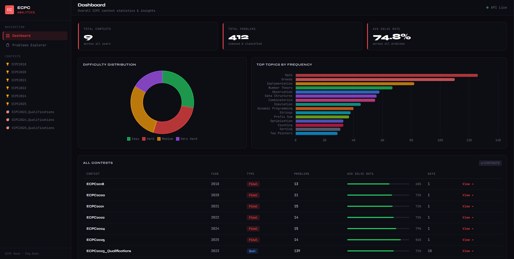
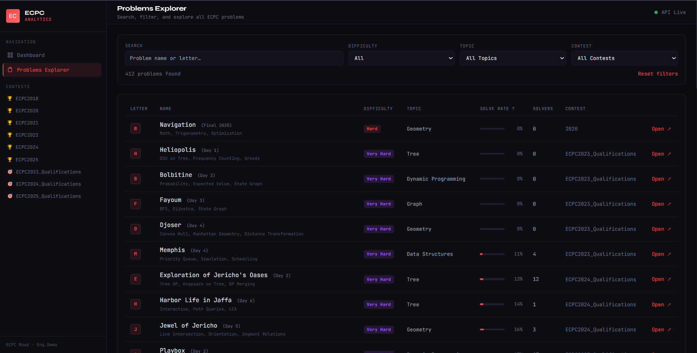
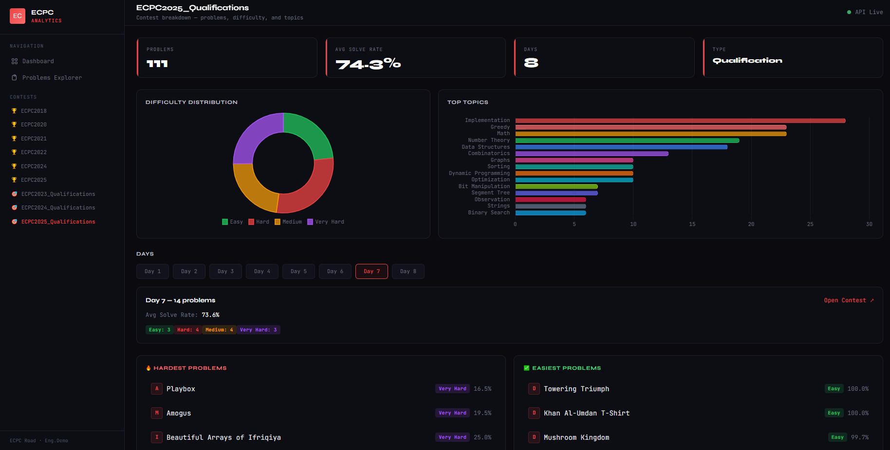

# ECPC Analytics

ECPC Analytics is a web-based platform for analyzing competitive programming contests across multiple years.  
It provides structured insights into problem difficulty, topic distribution, and contest composition.

## Overview

The system aggregates contest data and transforms it into meaningful analytics that help understand:

- how problem difficulty is distributed across contests  
- which topics appear most frequently  
- differences between qualification rounds and finals  
- detailed breakdown of problems within each contest  

## Screenshots

### Dashboard



The dashboard provides a high-level overview of all contests, including total problems, average solve rate, difficulty distribution, and topic frequency.

### Problems Explorer



The problems explorer allows searching and filtering problems by difficulty, topic, and contest.  
It is designed to quickly navigate large datasets and extract specific insights.

### Contest Analysis



Each contest page presents a detailed breakdown including difficulty distribution, top topics, per-day structure, and hardest and easiest problems.

## Features

- Difficulty distribution analysis  
- Topic frequency analysis  
- Advanced problem search and filtering  
- Qualification and finals comparison  
- Per-contest and per-day analytics  
- Clean and responsive interface  

## Architecture

The project follows a simple and effective structure:

- Flask backend for data processing and API endpoints  
- JSON-based dataset for contest problems  
- Server-rendered templates for UI  
- JavaScript for dynamic rendering and interaction  

## Tech Stack

- Python (Flask)  
- JavaScript  
- Tailwind CSS  
- Chart.js  

## Run Locally

**1. Install dependencies:**

```bash
pip install -r requirements.txt
```

**2. Configure environment:**

```bash
cp .env.example .env
```

Edit `.env` and set at minimum:

- `SECRET_KEY` — a random secret string (required for production)
- `ADMIN_API_KEY` — a random key to authorize the `/api/refresh` endpoint

**3. Run the development server:**

```bash
python app/app.py
```

Open in browser: [http://localhost:5000](http://localhost:5000)

## Production Deployment

For production, use [Gunicorn](https://gunicorn.org/) instead of the built-in dev server:

```bash
gunicorn -w 4 -b 0.0.0.0:5000 app.app:app
```

### Environment Variables

| Variable | Default | Description |
|---|---|---|
| `SECRET_KEY` | `dev-insecure-key` | Flask secret key — **set this in production** |
| `FLASK_DEBUG` | `0` | Set to `1` to enable debug mode |
| `CORS_ORIGINS` | `*` | Comma-separated allowed origins |
| `HOST` | `0.0.0.0` | Server bind address |
| `PORT` | `5000` | Server port |
| `LOG_LEVEL` | `INFO` | Logging level (DEBUG, INFO, WARNING, ERROR) |
| `ADMIN_API_KEY` | *(empty)* | Required to call `/api/refresh` |
| `RATE_LIMIT` | `60/minute` | Global rate limit per IP |

## Access to Problems

To open the problems directly on Codeforces, you need to join the ACPC Scientific Committee Archive.

You can join from here:
https://codeforces.com/group/Rilx5irOux/blog

This archive is one of the main and most reliable sources for Egyptian contests, and access is required to view the problems.


## Project Structure

```
app/
  app.py
  templates/
  static/
  ICPCRoad/
screenshots/
.env.example
.gitignore
README.md
LICENSE
requirements.txt
```

## Author

Adham Ahmed

## License

All rights reserved © 2026 Adham Ahmed
